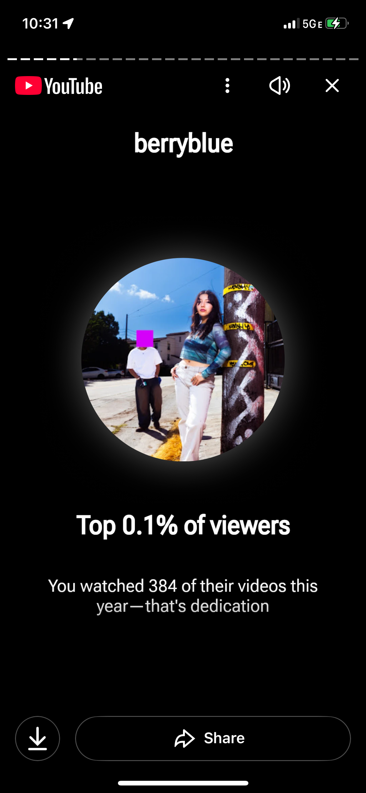

# Berryblue Pop Artist Fansite

This is an unofficial fan website for Berryblue, a pop artist from Dallas-Fort
Worth, Texas now based in Los Angeles, California.

## Production site

Live at: <https://berryblue.etok.me>

## Why Berryblue?

As a fan, I've listened to Berryblue on repeat since discovering them. I'm a Top
100 Listener and among the Top 0.1% of viewers on YouTube.



## Development

### Running locally

Open `index.html` directly in your browser, or use a local server:

```bash
deno run --serve --watch index.html
```

Then open http://localhost:8000

### Making changes

1. Edit `index.html` directly
2. Images go in `public/`
3. Test locally before committing

### Formatting

Before committing, format the code:

```bash
deno fmt
```

### Deployment

Commits to `main` automatically deploy to production via
[GitHub Pages](https://pages.github.com/).

---

Developed with 🫐 by [**@EthanThatOneKid**](https://github.com/EthanThatOneKid)
